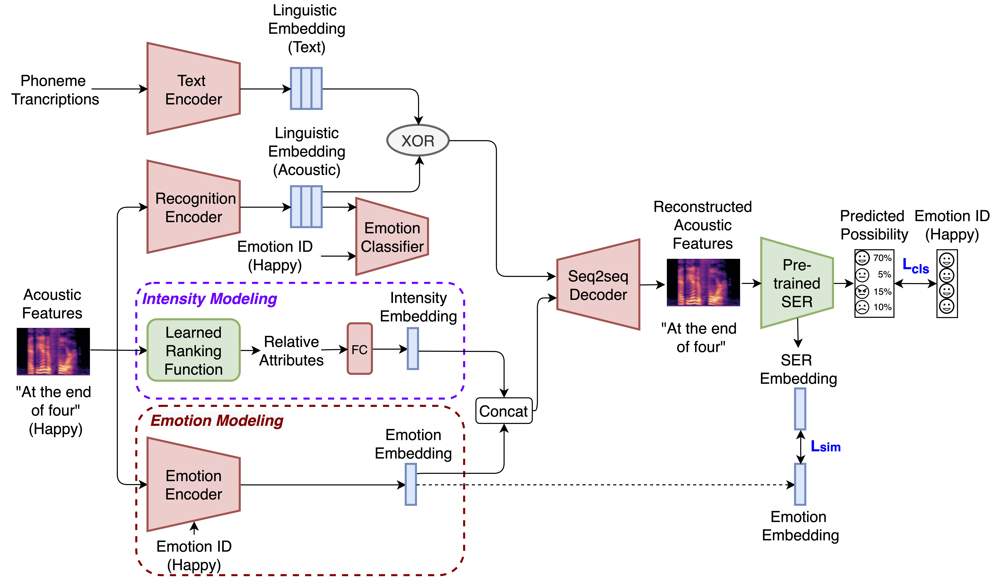

# Emovox
This is the implementation of the paper "Emotion Intensity and its Control for Emotional Voice Conversion".



## Step 1: Learning relative attributes

### 1) Extracting open-simle features

```Bash
python pre-processing.py
```

### 2) Training relative ranking function

```Matlab
main.m
```

## Step 2: Emotion recognizer training

```Bash
python train_ser.py
```

## Step 3: Emovox training

### 1) Style Pre-training

### 2) Emotion training

## Step 4: Run-time conversion


## Training log
